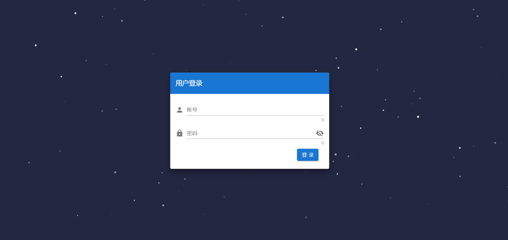
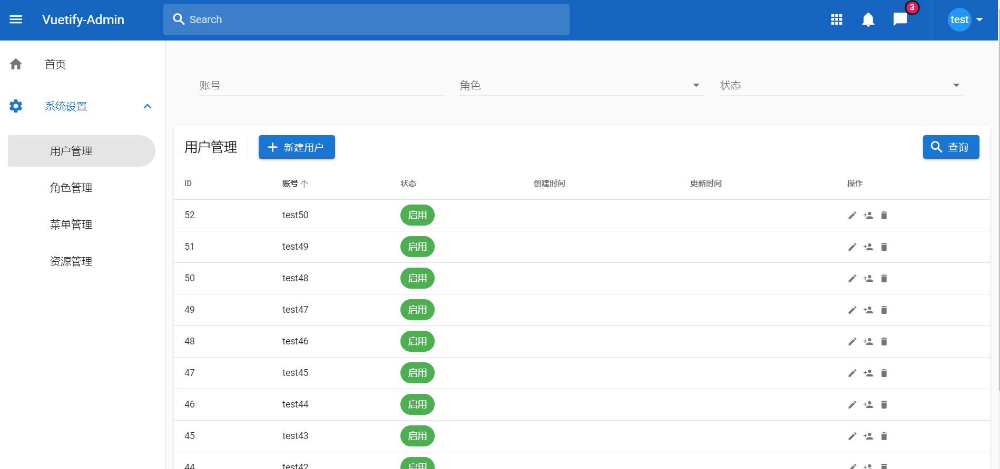
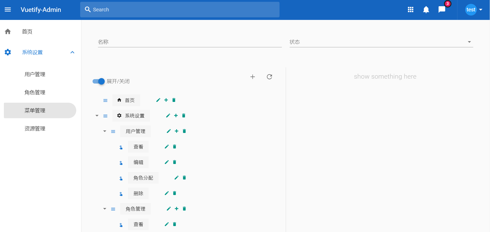
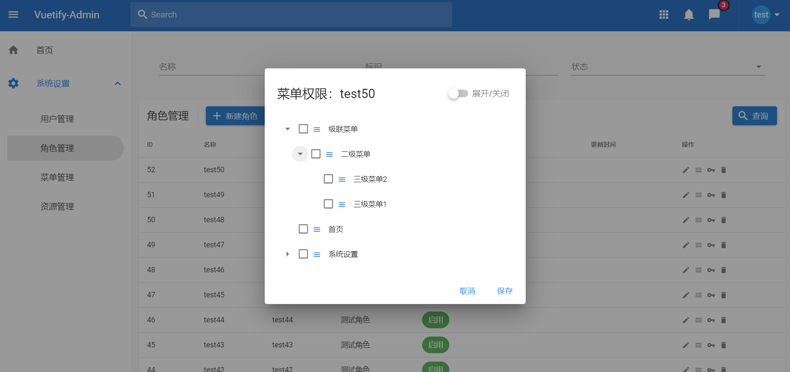

# 介绍

基于 [hyperf](https://hyperf.io/) [vuetify2.x](https://vuetifyjs.com/zh-Hans/) 构建的前后端分离后台管理系统

前端：基于权限的动态路由加载，按钮权限控制

后端：`restful api` ，[casbin](https://casbin.org/)权限管理

###### 演示地址

[demo](http://47.98.149.9:8000/)(账号：test，密码：123456)

# warning

项目中使用了[casbin](https://casbin.org/)做权限认证，并未检查 `casbin` 的 相关包 是否存在 swoole 协程污染等情况。

如在生产环境中使用，请自行检查。

# 使用方法

### docker

cd docker-compose

docker-compose up

### 单独部署

###### 前端

自行修改 frontend/vue.config.js/proxy 部分

###### 后端

`php bin/hyperf.php migrate --seed`

`php watch` //热加载开发

# 截图

